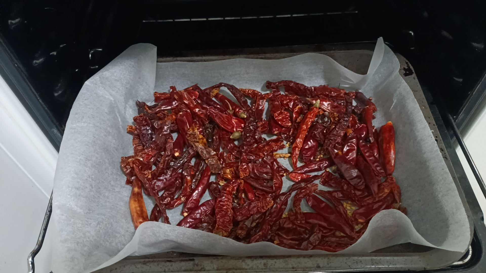

# 油泼辣椒1.0

## 材料

### 辣椒

干辣椒（二荆条，灯笼椒，朝天椒-2：2：1） —— 150g

甜椒粉 —— 50g

辣椒粉 —— 50g

### 香料

八角 —— 2个

桂皮 —— 1片

香叶 —— 3-4片

草果 —— 1个

丁香 —— 3个

花椒 —— 5g

洋葱 —— 1个

小葱 —— 3根

香菜 —— 3棵

姜 —— 30g（一小块）

## 步骤

### 料油制作

1. 菜籽油500g，大火加热
2. 冷油下入小葱香菜洋葱姜片
3. 小火炸至绿叶菜饱和度变高，下入香料
<video width="600" controls>
  <source src="../Media/湿料.mp4" type="video/mp4">
</video>

4. 小火炸至绿叶菜焦黄，捞出干料
<video width="600" controls>
  <source src="../Media/干料.mp4" type="video/mp4">
</video>

### 辣椒面制作（可使用购买辣椒面）

1. 烤箱预热80℃
2. 将干辣椒与花椒放入
3. 每5-10分钟翻拌一下
4. 待辣椒水分烤干拿出
<video width="600" controls>
  <source src="../Media/辣椒状态.mp4" type="video/mp4">
</video>

5. 将辣椒与花椒碾磨成辣椒面
<video width="600" controls>
  <source src="../Media/辣椒面.jpg" type="video/mp4">
</video>

### 泼辣油

1. 辣椒面中加入甜椒粉与辣椒粉
2. 加入5g盐，30g熟芝麻
3. 将辣椒面，辣椒粉，盐，熟芝麻拌匀
4. 加入适量高度酒，使干料轻微结团
5. 将料油加热至8成（240℃），即手放至油面上方轻微烫手
6. 将料油少量多次泼入辣椒中，每次泼入需搅拌使其充分融合
<video width="600" controls>
  <source src="../Media/加入酒.mp4" type="video/mp4">
</video>

7. 加盖密封保存一晚
